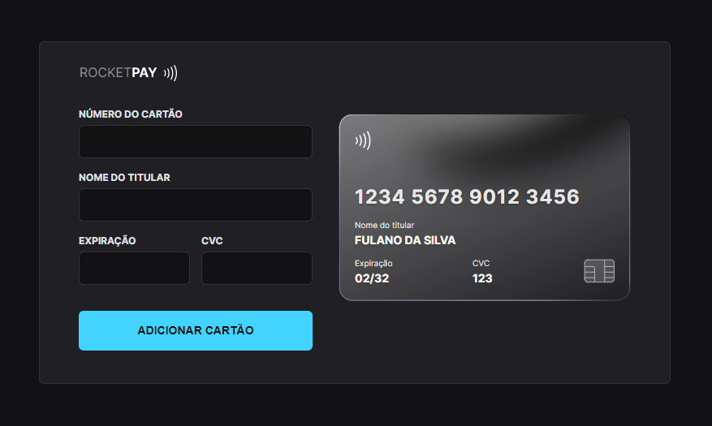
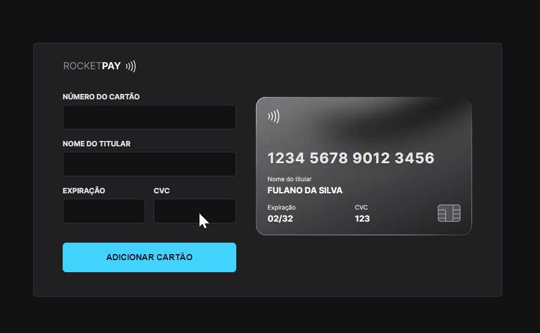

<h1 align="center"> Rocketpay - Explorer Lab #01 </h1>

Exclusive and free event, promoted by Rocketseat.

  <a href="#-technologies">Technologies</a>&nbsp;&nbsp;&nbsp;|&nbsp;&nbsp;&nbsp;
  <a href="#-project">Project</a>&nbsp;&nbsp;&nbsp;|&nbsp;&nbsp;&nbsp;
  <a href="#-deploy">Deploy</a>&nbsp;&nbsp;&nbsp;|&nbsp;&nbsp;&nbsp;
  <a href="#%EF%B8%8F-what-i-learned">Learned</a>&nbsp;&nbsp;&nbsp;|&nbsp;&nbsp;&nbsp;
  <a href="#-layout">Layout</a>&nbsp;&nbsp;&nbsp;|&nbsp;&nbsp;&nbsp;
  <a href="#memo-license">License</a>

  

 

  

## 🚀 Technologies

This project was built using following technologies:

- HTML
- CSS
- JavaScript
- JSON
- Regex
- GIT
- [Node e NPM](https://nodejs.org/)
- [Vite](https://vitejs.dev/)
- [iMask](https://imask.js.org)

## 💻 Project

The Rocketpay project is a component that simulates a credit card form where it's possible to add input masks and update HTML elements through DOM.

## 🌎 Deploy
Live Site URL: [rocketpay-tascintra.vercel.app](https://rocketpay-tascintra.vercel.app/)

## ✔️ What I learned

In this project I learned how to use a 3rd party library to create input masks that were used to get credit card information, how to use regular expressions to filter this information and how to handle dialog boxes for user information messages.

## 🔖 Layout

You can visualize the project layout through [THIS LINK](https://www.figma.com/file/gpqavL469k0pPUGOmAQEM9/Explorer-Lab-%2301/duplicate). A [Figma](https://figma.com) account is needed to access it.

## :memo: License

This project is under a MIT license.

---

Built with ♥ by Rocketseat :wave: [Be part of our community!](https://discord.gg/rocketseat)
